# ☎️IBM Telco Customer Churn Analysis
Customer churn is a critical challenges in the telecommunication industry, where retaining existing users is significantly more cost-effective than acquiring new ones. This project leverages the IBM Telco Customer Churn dataset to uncover underlying behavioral patterns and predict potential churners.

---

## 📖Outline
1. [Project Overview](#project-overview)
2. [Dataset Information](#dataset-information)
3. [Exploratory Data Analysis](#exploratory-data-analysis)
4. [Data Preprocessing](#️data-preprocessing)
5. [Modeling](#modeling)
6. [Final Evaluation](#final-evaluation--conclusion)
7. [Future Improvement](#future-improvement)
8. [Folder Structure](#folder-structure)
9. [How to Run](#how-to-run-step-by-step)


---

## 📌Project Overview
### The Objective
The primary goal of this project is to analyze the IBM Telco Customer Churn dataset to uncover underlying behavioral patterns and predict potential churners. By maximazing the recall score for predicting the positive churn label, this machine learning model aims to catch as many potential churners as possible, enabling proactive retention strategies.

### The Approach
To build a robust prediction model, establishing a comprehensive data science pipelines is necessary. First, five seperate Excel files was merged into a cohesive master dataset. During early preprocessing, we conducted exploratory data analysis for find insights about customer churn behavior. To prepare the data for machine learning, we need to handle categorical feature, skewness, and data imbalance. Finally, we are going to train multiple advance machine learning algorithms that focuse on maximazing the Recall Score.

---

## 📊Dataset Information
The data from this project originates from [IBM Cognos Analytics](https://community.ibm.com/community/user/blogs/steven-macko/2019/07/11/telco-customer-churn-1113) sample datasets. It tracks customer churn, subscribed services, account information, and demographics for a fictional telecommunications company. I retrieved this specific version of the dataset from [Kaggle Telco customer churn (11.1.3+)](https://www.kaggle.com/datasets/ylchang/telco-customer-churn-1113). The raw data provided on Kaggle includes `Telco_customer_churn_demographics.xlsx`, `Telco_customer_churn_location.xlsx`, `Telco_customer_churn_population.xlsx`, `Telco_customer_churn_services.xlsx`, and `Telco_customer_churn_status.xlsx`.

### Data Integration Process
From those information, not all features were relevant for our customer churn analysis. Therefore, we need to carefully select features and remove redundant or uninformative data points before merging.

#### Features Removed
Several columns were excluded from the final master dataset as they did not contribute meaningful variance or were redundant:
* **Administrative & Single-Value Columns:** Feature like `Count` and `ID` were dropped as they offer no predictive value.
* **Redundant Spatial Data:** The `Lat Long` column was removed because the individual `Latitude` and `Longitude` columns already captured
* **Overlapping or Irrelevant Columns:** Features such as `Dependents` (redundant to `Number of Dependents`), `Quarter` (static time indicator), `Referred a Friend`, and `Offer` were dropped also.

#### Features Retained
The remaining 40 columns were carefully chosen to provide a holistic view of the customer across four key dimensions:
* **Customer Demographics:** `Age`, `Gender`, `Senior Citizen`, `Married`, etc., to identify if certain life stages correlate with churn.
* **Location & Population:** `City`, `Zip Code`, and `Population` density to capture regional behavioral trends.
* **Account & Service Usage:** `Internet Type`, `Tenure in Months`, `Contract type`, and `Monthly Charge`. These are critical indicators of customer engagement, financial commitment, and overall satisfaction.

---

## 📈Exploratory Data Analysis
Our EDA phase served a dual purpose, which are understanding the underlying data distribution to inform necesary preprocessing techniques and extracting actionable business insights regarding chustomer churn behavior.

### Technical Data Assesment
By evaluating the data's structure, we can identify several preprocessing requirements:
* **Cardinality Analysis:** Evaluating the frequency of categorical variables to manage high cardinality. For instance, `City` feature contained many rare values, so we will group these rare values into an 'Others'.
* **Target Imbalance:** `Churn Label` confirmed a significant skew between retained and churned customers. We can handle this with using whether resampling techniques (SMOTE-NC) or Class Weighting method.
* **Skewness Shape:** I detected that the numerical features is not really have a perfect skew. We can conclude a data transformation techniques or build robust machine learning algorithms, such as Random Forest and Gradient Boosting.

### Key Business Insights
To obtain a focus analysis, we are going to analyze the data based on several hypotheses:
1.  Do customers cancel more frequently when their monthly bills cross a certain financial threshold compared to those on 1-year or 2-year contracts?
<div align="center">
  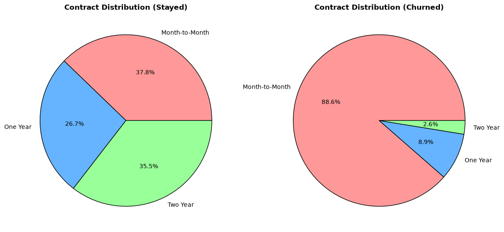
  <p><i>Figure 1: Customer Churn Rate by Contract Type</i></p>
</div>

> **Business Insight:** Pie chart tells us that churners are dominated by *Month-to-Month* contract around **88.6%**. This indicates that *Month-to-Month* customers are highly flexible to leave. In the other hand, Stayed Customers are more uniform, separated from *Month-to-Month* and *Two Year*.

<div align="center">
  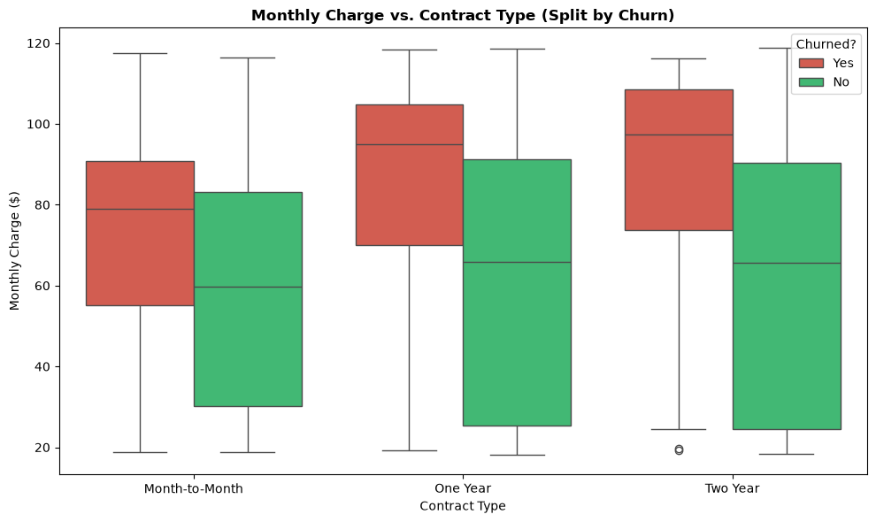
  <p><i>Figure 2: Customer Churn Rate by Contract Type</i></p>
</div>

> **Business Insight:** Most of the churner are leaving when their pay bills are expensive. For *Month-to-Month*, customers tend to leave when their bills are around 80$. The other side, customers with *One Year* and *Two Year* contract usually don't easily break the long-term contract, unless their bills are around 90$ more expensive than *Month-to-Month* contract.

2. Do younger customers rely on the service more (or less) than older customers?
<div align="center">
  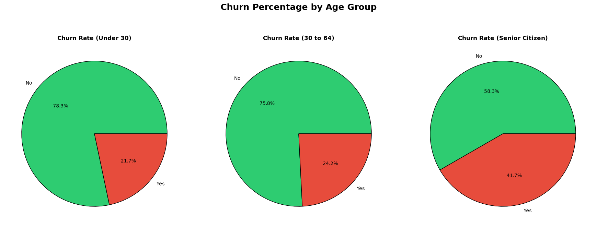
  <p><i>Figure 3: Customer Churn Rate by Age Group</i></p>
</div>

> **Business Insight:** While the younger and middle-aged demographics have a churn rate of around 21% to 24%, the *Senior Citizen* churn rate spikes to **41.7%**. This means that nearly half of the senior demographic is leaving the company. Interestingly, both group *Under 30* and *30 to 64* maintain a solid retention rate of around 75% to 78%, indicating that customers don't slowly get more likely to leave as they age.

**New Hypotheses:** Are their household size trigerring Senior Citizen churning?
<div align="center">
  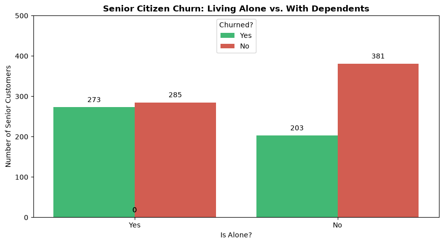
  <p><i>Figure 4: Senior Citizen Churn: Living Alone vs. With Dependents</i></p>
</div>

> **Business Insight:** Senior that living alone have a nearly **50%** churn rate. This group is highly vulnerable, likely due to a combination of fixed incomes and lack of at-home technical support. Besides, when they live with others (like a spouse or younger dependents), the presence of other people using internet or phone lines drastically reduces the likelihood that the senior will cancel the service.

3. Does the way a person pays their bill affect how long they stay?
<div align="center">
  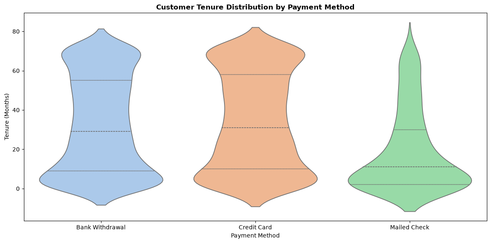
  <p><i>Figure 5: Customer Tenure Distribution by Payment Method</i></p>
</div>

> **Business Insight:** The buttom bulge of green violin indicates that the vast majority of customers who pay by *Mailed Check* have extremely short tenures (mostly under 10-15 months). However, the other methods (*Bank Withdrawal* and *Credit Card*) show two bulges at the bottom and top. These shape reveal that customers using these method fall into two main campus: those who churn immediately and those who stay for a very long time (around more than 65 months). This indicates that manual payment method (*Mailed Check*) is highly correlated with early churn, while the automatic one (*Bank Withdrawal* and *Credit Card*) perform equally well at maintaining high-tenure customers.

4. Does referring friends or family lock a customer into the ecosystem?
<div align="center">
  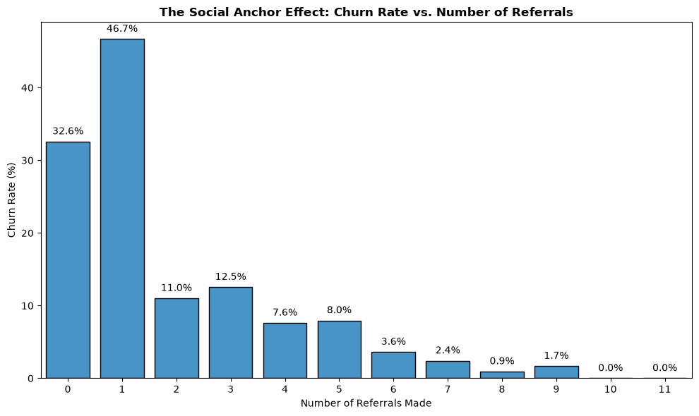
  <p><i>Figure 6: The Social Anchor Effect: Churn Rate vs. Number of Referrals</i></p>
</div>

> **Business Insight:** While the 0 referrals reveals a high churn rate (**32,6%**), the highest churn rate (**46.7%**) occurs at exactly 1 referrals, suggesting customers are abusing short-term referral promotion and leaving. This is likely because the company ran a campaign like "Refer a friend and get a free month.". However, from 4 referrals onward, the churn rate never goes above **8%**, eventually flatlining near **0%** for users with 8+ referrals.

5. Does giving a customer a refund actually save them, or is it just a precursor to them leaving away?
<div align="center">
  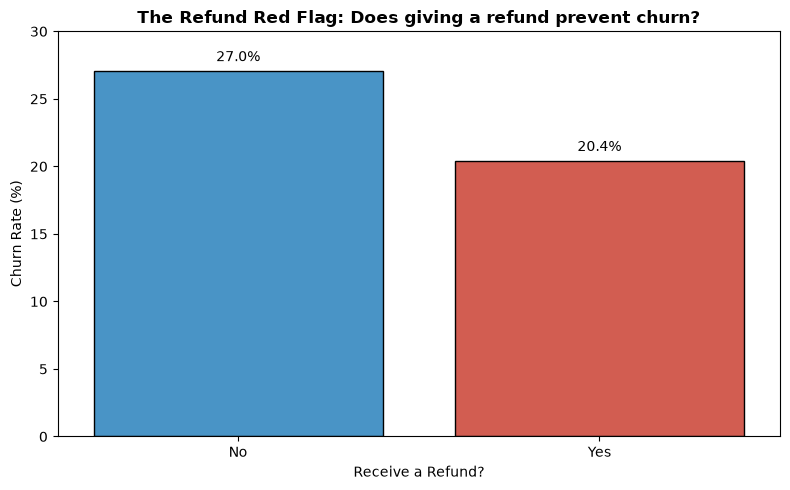
  <p><i>Figure 7: The Refund Red Flag: Does giving a refund prevent churn?</i></p>
</div>

> **Business Insight:** While issuing refunds provides a slight 6.6% reduction in churn, the churn rate remains high with over 20% of refunded customers. This means providing a refund is **NO** associated with churn potential.

6. Are customers churning because they feel dissatisfied with certain services they subscribe to?
<div align="center">
  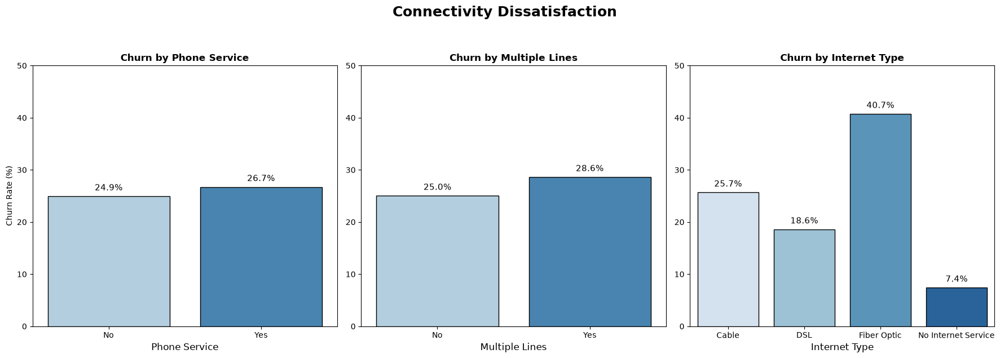
  <p><i>Figure 8: Connectivity Dissatisfaction</i></p>
</div>

> **Business Insight:** Whether a customer has phone service or not, the churn rate barely changes (24.9% vs. 26.7%). The same is true for multiple lines (25.0% vs. 28.6%). However, Customer with **Fiber Optic** internet are churning at a rate of **40,7%**. Fiber Optic internet is supposed to be the fastest and best product. The customer may be dissatisfied with this company's premium internet.

<div align="center">
  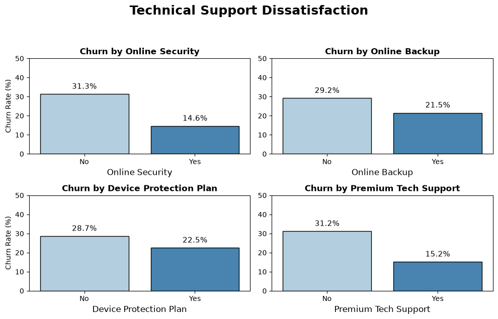
  <p><i>Figure 9: Connectivity Dissatisfaction</i></p>
</div>

> **Business Insight:** The most dramatic drops in churn come from **Online Security** (dropping from 31,3% to 14,6%) and **Premium Tech Support** (dropping from 31,2% to 15.2%). Having these services help customer to eliminate technical friction. In the other hand, while online backup and device protection plan reduce churn, the drops are mucn softer. Customers are care far more about their network actively working and being secure (Tech Support / Security) than they do about hardware warranties or cloud storage.

<div align="center">
  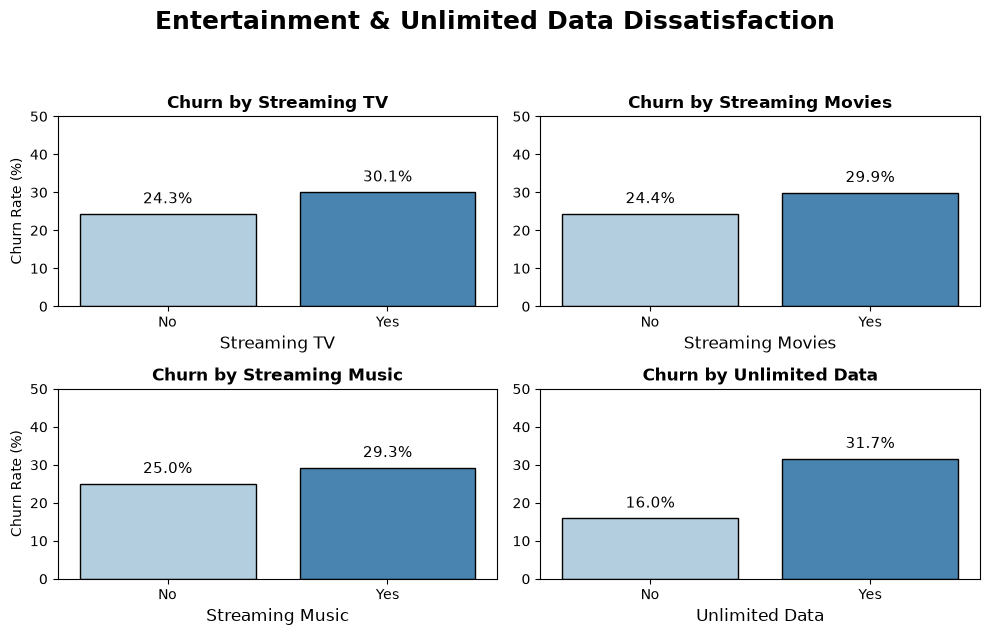
  <p><i>Figure 10: Connectivity Dissatisfaction</i></p>
</div>

> **Business Insight:** Across all three streaming categories (TV, Movies, and Music), customers who subscribe these service don't churn at a drastical rate. Streaming services inflate the customer's monthly charge, driving customers to cancel this just because they want to find cheaper bundle. However, customers who are paying for **Unlimited Data** more sensitive to churn (**31,7%**)

---

## 🛠️Data Preprocessing
To ensure the machine learning models could extract the maximum amount of signal, the dataset underwent a rigorous cleaning and transformation pipeline.

### 1. Feature Engineering
To give the models a deeper understanding of customer behavior and potential friction points, I engineered several new features from the existing raw data:
1.  **Financial & Value Perception:**
    * `Historical Avg Monthly Charge` & `Bill Shock`: Calculated the customer's historical avarage cost and created a `Bill Shock` flag to identify users whose current monthly charge exceeds their historical average.
    * `Cost per GB`: Created a feature that capture the actual value the customer is getting for their data usage.
    * `Receive Refund`: Flagged a customer whether they received any refund, which can indicate past billing disputes or service issues..
2. **Service Engagement & Utilization:**
    * `Total Services Subscribed`: Aggregated eight individual service columns (e.g., Online Security, Streaming TV, Tech Support) into a single numeric score to measure overall ecosystem lock-in.
    * `Under-Utilizing Unlimited`: Created a highly targeted flag to identify customers paying for an 'Unlimited Data' plan but downloading less than the average user.
3. **Demographics & Lifecycle:**
    * `Household Size` & `Is Alone`: Combined marital status and dependent counts to determine the total household size, and flagged single-person households.
    * `Tenure Group`: Binned raw continuous tenure data into clear lifecycle stages (New, Standard, Loyal, Very Loyal).
    * `30 to 64` & `Referral a Friend`: Isolated the middle-aged demographic and flagged customers who have successfully referred others.

### 2. Feature Reduction
The next step was to streamline the dataset by removing features that offered no predictive value:
* **Identifier:** Drop unique identifier (`Customer ID`).
<div align="center">
  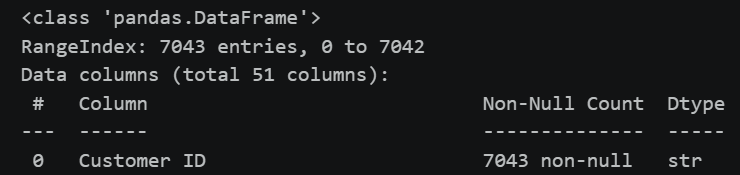
  <p><i>Figure 11: Customer ID from df.info() Function</i></p>
</div>

* **Zero Variance:** Drop features that is just have 1 unique value, which are `Country` and `State`.
<div align="center">
  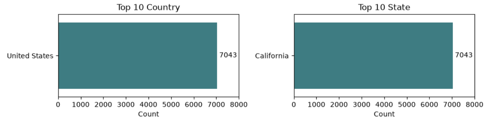
  <p><i>Figure 12: Country and State Distribution</i></p>
</div>

### 3. Data Splitting & Target Separation
To establish a robust evaluation framework and prepare for the advance preprocessing (Data Oversampling and Data Transformation) and final modeling phase, the processed dataset was partitioned.

* **Target Separation:** Isolated the primary prediction target (`Churn Label`) from the predictor features (X).
* **Train-Val-Test Split**: Partitioned the data using 70/15/15 split. 70% of the data will be allocated for training the models, 15% be used for training helper (early stopping for boosting-based model), and 15% reserved as an unseen testing set to evaluate generalization capability.

### 4. Handling Imbalance Target
Telecommunications churn datasets are inherently imbalanced, as the majority of customers are retained while only a fraction leave. Training a model directly on this skewed data often results in a bias toward the majority class, severely hurting the model's ability to predict actual churners.
<div align="left">
  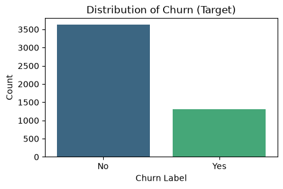
  <p><i>Figure 13: Churn Distribution</i></p>
</div>

To solve this, I conducted an empirical comparison between two distinct balancing techniques to determine which yielded the best evaluation metrics (specifically maximizing Recall). The used models in this section are mostly tree-based algorithm considering the data skewness:

* **Data-Level Resampling (SMOTE-NC)**: I tested the Synthetic Minority Over-sampling Technique for Nominal and Continuous features.
<div align="left">
  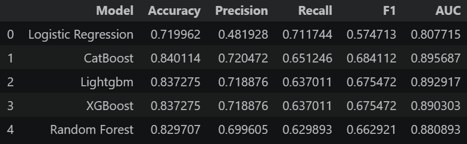
  <p><i>Figure 14: SMOTE-NC Evaluation</i></p>
</div>

* **Algorithmic Class Weighting**: Alternatively, I tested cost-sensitive learning by adjusting the internal hyperparameters of the models (e.g., `class_weight='balanced'` or `scale_pos_weight`).
<div align="left">
  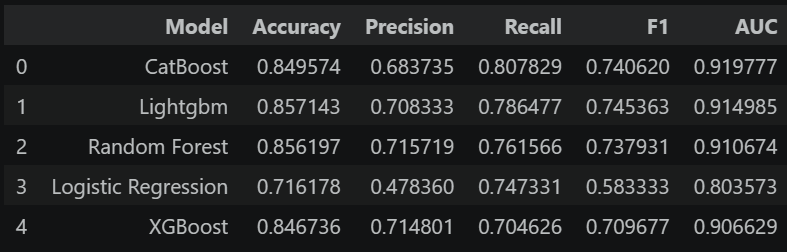
  <p><i>Figure 15: Class Weighting Evaluation</i></p>
</div>

From those evaluations, Class Weighting method overperformed about ~10% in recall score. We are going to use Class Weighting to handle the imbalance target.

### 5. Data Transformation
#### a. Data Encoding
To process the categorical variables, three distinct encoding strategies were utilized based on feature cardinality and structure:

* **Binary Encoding:** Applied to boolean-like features (e.g. `Under 30`, `Senior Citizen`, `Married`, `Phone Service`, `Churn Label` etc.) and `Gender`.
* **One-Hot Encoding:** Applied to lower-cardinality nominal categorical features (`Internet Type`, `Contract`, `Payment Method`, and `Tenure Group`). The handle_unknown='ignore' parameter was explicitly set to ensure the pipeline remains robust if it encounters unseen categories in the unseen test data.
* **Target Encoding:** Utilized specifically for the high-cardinality features (`City`). By replacing the categories with the expected value of the target, the model can capture the geographical signal without inflating dimensionality. A smoothing factor (smooth='Auto') was applied to prevent overfitting on categories with limited samples.

#### b. Data Scaling & Outlier Handling
During the exploratory data analysis, I observed that several continuous numerical features (such as `Total Charges` and `Avg Monthly GB Download`) exhibited significant skewness and contained natural outliers. However, I deliberately chose not to apply feature scaling (e.g., StandardScaler, MinMaxScaler) or any outlier handler because of some reasons:

* **Algorithm Sustainability:** The machine learning algorithms selected for this project are entirely tree-based ensemble methods (Random Forest, XGBoost, LightGBM, and CatBoost), which work in scale-invariant and extreme outliers.
* **Preserving Predictive Signal:** In the context of telecommunication, an outlier ofter represents as a real and extreme customer behavior. Altering or removing these signals could destroy valuable signal.

---

## 🤖Modeling
In this phase we are going to build a classification model that capable to predict customer churn (`Churn Label`) based on our processed data. I aimed to get maximum of recall score, so our model can capture a large amount of the churners. To ensure computational resources are invested efficiently, we adopted a structured modeling approach.

### 1. Model Selection (Baseline Contest)
Before committing to time-intensive hyperparameter tuning, it is critical to establish baseline performances across a diverse set of algorithms. This benchmarking step allows us to identify the architectures that naturally handle our dataset's structure best.

**Baseline Results:**
| Model | Accuracy | Precision | Recall | F1 | AUC |
| :--- | :--- | :--- | :--- | :--- | :--- |
| CatBoost | 0.849574 | 0.683735 | 0.807829 | 0.740620 | 0.919777 |
| Lightgbm | 0.857143 | 0.708333 | 0.786477 | 0.745363 | 0.914985 |
| Random Forest | 0.856197 | 0.715719 | 0.761566 | 0.737931 | 0.910674 |
| Logistic Regression | 0.716178 | 0.478360 | 0.747331 | 0.583333 | 0.803573 |
| XGBoost | 0.846736 | 0.714801 | 0.704626 | 0.709677 | 0.906629 |

From these results, **CatBoost**, **LightGBM**, and **Random Forest** clearly emerged as the top three performers. They all achieved high recall scores (capturing over 75% of actual churners) while maintaining strong overall accuracy and AUC. Therefore, these three models will advance to the Hyperparameter Tuning phase.

### 2. Model Diagnostic & Visual Analysis (Before Tuning)

#### a. Learning Curve
<div align="center">
  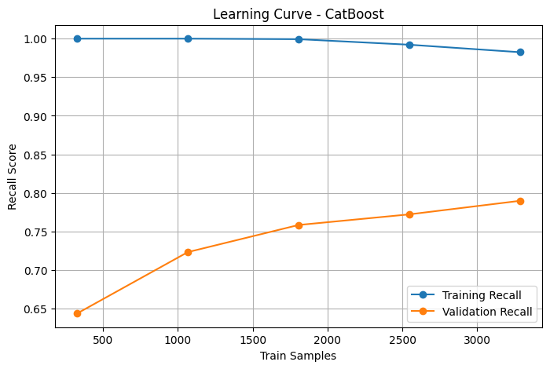
  <br><br>
  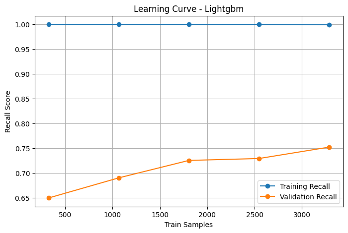
  <br><br>
  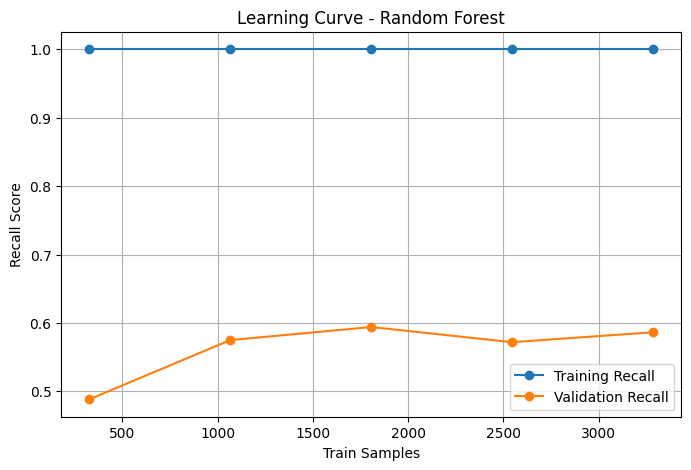
  <p><i>Figure 16-18: Learning Curve before Hyperparameter Tuning.</i></p>
</div>

That learning curve plot shows that recall on the training set vs. the validation set as the number of training samples increases. **CatBoost** training recall score close to 1 (which means almost perfect), while validation recall remains behind. This indicating overfitting gap. Meanwhile, **LightGBM** and **Random Forest** shows the same pattern (a big gap between training and evaluation recall), even recapturing the training recall about 100% of churners. This indicating that the models really fit with the data.

#### b. ROC Curve & AUC

<div align="center">
  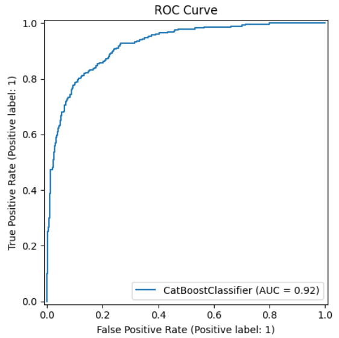
  <br><br>
  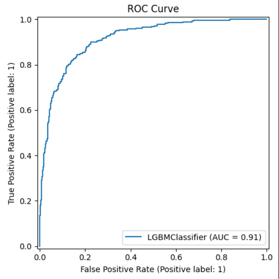
  <br><br>
  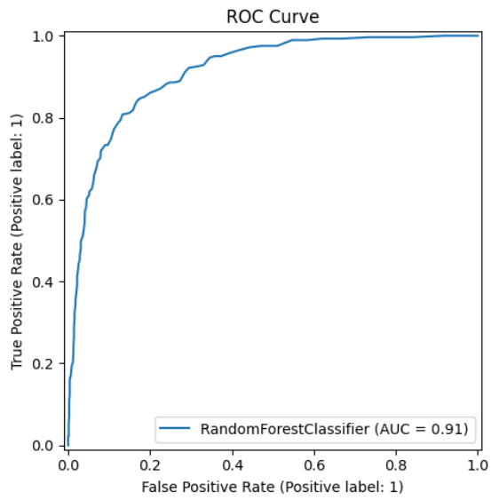
  <p><i>Figure 21-23: ROC Graph before Hyperparameter Tuning.</i></p>
</div>

All those three baseline models already produce a strongly bowed curve that rises steeply at low false-positive rates and flattens out near the top before reaching FPR = 1. This is a sign that the model is confidently separating most churners from non-churners even before any tuning.

### 3. Feature Selection
<div align="center">
  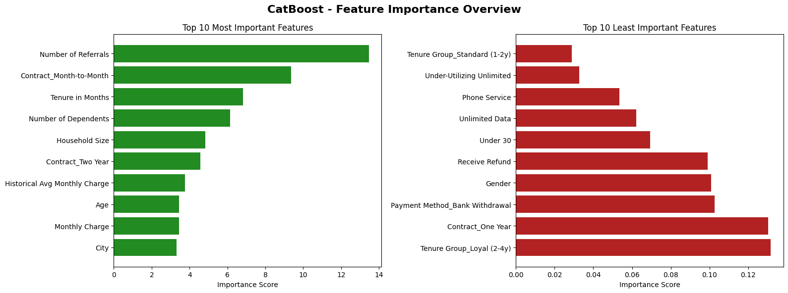
  <br><br>
  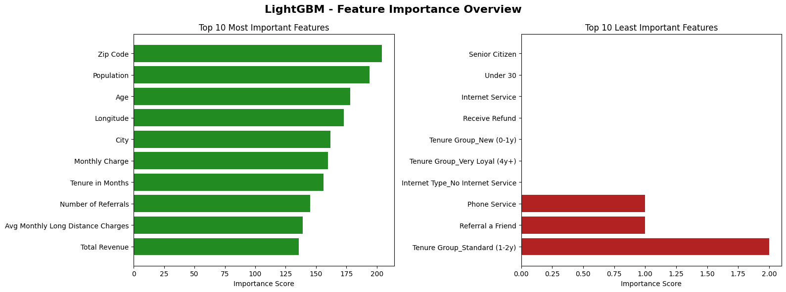
  <br><br>
  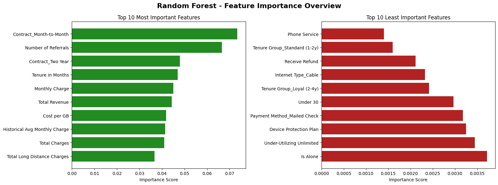
  <p><i>Figure 24-25: Feature Important</i></p>
</div>
The three best-performing tree-based models (CatBoost, LightGBM, Random Forest) were used to inspect feature importance. For each model, the 15 least important features were dropped, producing a model-specific reduced feature set. This reduces noise/redundant features while keeping each model's most influential predictors.

### 4. Hyperparameter Tuning
Each of the three reduced-feature models (CatBoost, LightGBM, Random Forest) was tuned independently using **Optuna**, running **50 trials per model** with the goal of **maximizing recall** on the validation set. Recall was chosen as the optimization target because, for churn prediction, failing to flag an actual churner is more costly than a false alarm.
* **CatBoost** and **LightGBM** additionally used early stopping (50 rounds) during each trial's training, so Optuna also implicitly searched over how many boosting iterations were useful before validation performance stalled.
* **Random Forest** doesn't have a native early-stopping mechanism, so `n_estimators` itself was included as a tunable parameter instead.

**Search Space per Model:**
| Model | Parameters searched | Range |
|---|---|---|
| CatBoost | `learning_rate` | 0.01 – 0.2 (log scale) |
| | `depth` | 4 – 10 |
| | `l2_leaf_reg` | 1.0 – 10.0 |
| | `random_strength` | 0.1 – 10.0 (log scale) |
| | `bagging_temperature` | 0.0 – 1.0 |
| LightGBM | `learning_rate` | 0.01 – 0.1 (log scale) |
| | `max_depth` | 3 – 9 |
| | `num_leaves` | 10 – 100 |
| | `subsample` | 0.5 – 1.0 |
| | `colsample_bytree` | 0.5 – 1.0 |
| | `reg_alpha` | 1e-8 – 10.0 (log scale) |
| | `reg_lambda` | 1e-8 – 10.0 (log scale) |
| Random Forest | `n_estimators` | 100 – 1000 (step 100) |
| | `max_depth` | 3 – 20 |
| | `min_samples_split` | 2 – 20 |
| | `min_samples_leaf` | 1 – 20 |
| | `max_features` | `sqrt`, `log2`, `None` |

**Best Trial Found per Model:**
| Model | Best trial | Best validation recall | Best parameters |
|---|---|---|---|
| CatBoost | 39 / 50 | 0.857 | `learning_rate=0.0141`, `depth=4`, `l2_leaf_reg=6.89`, `random_strength=7.77`, `bagging_temperature=0.51` |
| LightGBM | 23 / 50 | 0.829 | `learning_rate=0.0251`, `max_depth=3`, `num_leaves=46`, `subsample=0.54`, `colsample_bytree=0.99`, `reg_alpha=9.84`, `reg_lambda=0.0003` |
| Random Forest | 49 / 50 | 0.886 | `n_estimators=100`, `max_depth=4`, `min_samples_split=9`, `min_samples_leaf=18`, `max_features=None` |

### 5. Model Diagnostic & Visual Analysis (After Tuning)

#### a. Learning Curve
<div align="center">
  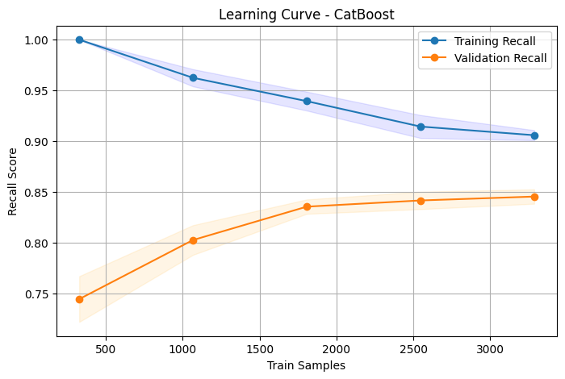
  <br><br>
  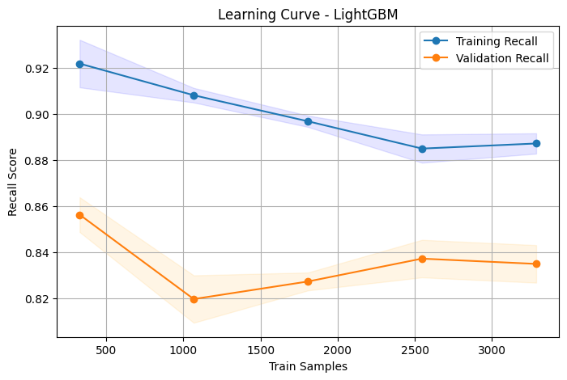
  <br><br>
  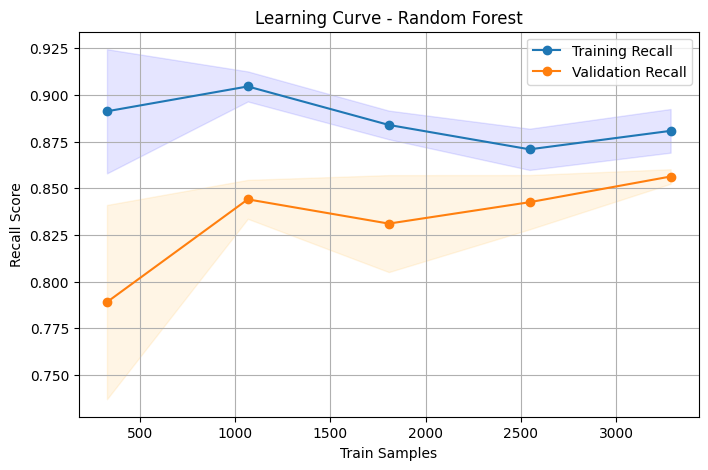
  <p><i>Figure 16-18: Learning Curve after Hyperparameter Tuning.</i></p>
</div>

* **Catboost:** The training/validation gap narrows noticeably compared to its pre-tuning curve. The shallower `depth=4` and stronger `l2_leaf_reg`/`random_strength `regularization pull training recall down slightly while validation recall climbs, so the two lines converge much closer together as training size increases.
* **LightGBM:** Same pattern as CatBoost, `max_depth=3` plus `reg_alpha`/`reg_lambda` regularization close the gap substantially, with validation recall now tracking training recall far more closely than in the baseline version.
* **Random Forest:** The gap also shrinks here. The tuned forest is far more constrained (`max_depth=4`, `min_samples_leaf=18`) than the baseline's unconstrained trees and validation recall rises the most dramatically of the three models. It still shows a bit more residual gap than CatBoost/LightGBM, which is expected since bagged trees are naturally more prone to memorizing training data than regularized, sequentially-boosted models.

**Overall**, tuning + feature selection consistently narrowed the train/validation gap across all three models — the tuning step was primarily about controlling overfitting and improving generalization, not squeezing out extra raw training performance.

#### b. ROC Curve & AUC

<div align="center">
  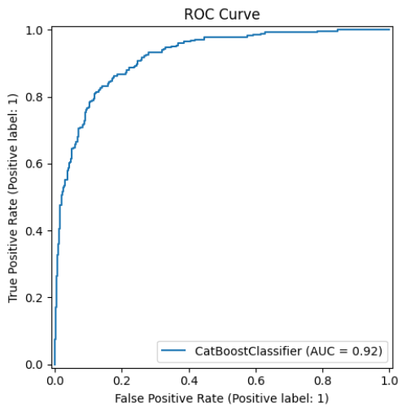
  <br><br>
  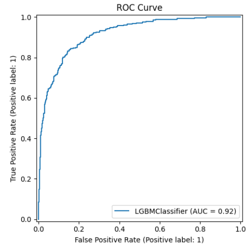
  <br><br>
  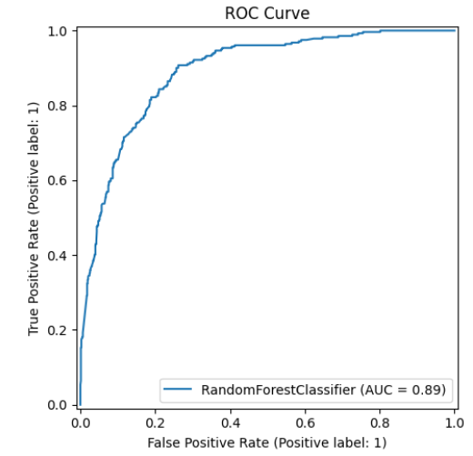
  <p><i>Figure 21-23: ROC Graph after Hyperparameter Tuning.</i></p>
</div>

**Overall**, AUC stayed essentially flat for CatBoost and LightGBM through tuning, while Random Forest traded some AUC for a large recall gain, a direct consequence of the tuning objective targeting recall rather than AUC.

---

## 🏆Final Evaluation & Conclusion
The tuned models were retrained on their respective reduced feature sets and evaluated on the held-out test set:

| Model | Accuracy | Precision | Recall | F1-Score | ROC-AUC |
|---|---|---|---|---|---|
| **CatBoost** | 0.830 | 0.632 | 0.861 | **0.729** | **0.920** |
| **LightGBM** | 0.830 | 0.635 | 0.847 | 0.726 | 0.917 |
| **Random Forest** | 0.785 | 0.561 | **0.886** | 0.687 | 0.892 |

* **CatBoost** achieved the best overall balance (highest F1 and AUC).
* **Random Forest** achieved the highest recall, useful if catching every potential churner is the priority, at the cost of more false positives.

---

## 🔥Future Improvement
A few directions worth exploring beyond this project's current scope:
* **Give regression-based models a fairer shot:** Logistic Regression was included as a baseline mainly for comparison, and the pipeline was built with tree-ensemble models in mind, so steps like feature scaling and outlier handling were skipped, since tree-based models don't need them. Despite that, Logistic Regression still landed a surprisingly reasonable AUC (~0.80) in the baseline evaluation. With proper preprocessing (standardization/normalization, outlier treatment, possibly polynomial or interaction features), it's worth revisiting regression-based models to see how much of that gap to the tree-ensemble models closes.
* **Try ensemble methods that combine multiple models:** Rather than picking a single winner (CatBoost, LightGBM, or Random Forest), a stacking or voting ensemble that blends predictions from all three could capture complementary strengths.
* **Deploy the model as an interactive app:** Wrapping the exported model in a lightweight app (using Streamlit for a quick interactive demo, or Flask/FastAPI for a proper REST API) would make the model usable outside the notebook.

---

## 📁Folder Structure

```
Telco-Chustomer-Churn-Analysis
├── Datasets/
│   ├── Modeling/
│   │   ├── X_test.csv
│   │   ├── X_train.csv
│   │   ├── X_val.csv
│   │   ├── y_test.csv
│   │   ├── y_train.csv
│   │   └── y_val.csv
│   ├── Processed/
│   │   └── processed_data.csv
│   └── Raw/
│       ├── Telco_customer_churn_1.csv
│       ├── Telco_customer_churn_2.csv
│       ├── Telco_customer_churn_3.csv
│       ├── Telco_customer_churn_4.csv
│       ├── Telco_customer_churn_5.csv
│       └── Telco_customer_churn_6.csv
├── Models/
│   ├── CatBoost_Model.pkl
│   ├── LightGBM_Model.pkl
│   └── Random_Forest_Model.pkl
├── Notebooks/
│   ├── advance_preprocessing.ipynb
│   ├── data_merging.ipynb
│   ├── early_preprocessing.ipynb
│   └── modeling.ipynb
├── Visualizations/
│   ├── figure_1.png
│   ├── figure_2.png
│   ├── ...
│   └── figure_32.png
├── README.md
└── requirements.txt
```

---

## 🚀How to Run (Step-by-Step)

### Step 0 — Clone Repository
```bash
# Clone repository
git clone https://github.com/n44th44nn/Telco-Chustomer-Churn-Analysis.git

# Change direction to the cloned repository
cd Telco-Chustomer-Churn-Analysis
```

### Step 1 — Set Up a Virtual Environment
```bash
# Create the virtual environment
python -m venv venv

# Activate the virtual environment on Windows:
venv\Scripts\activate

# Activate the virtual environment on macOS/Linux:
source venv/bin/activate
```

### Step 2 — Install Dependencies
```bash
pip install -r requirements.txt
```

### Step 3 — Launch Jupyter Notebook
```bash
jupyter notebook
```

### Step 4 — Execution Order
1. `data_merging.ipynb`: Merges the raw separated datas and select usefull features for analysis.
2. `early_preprocessing.ipynb`: Cleans the raw data, handles missing values, and standardizes initial text features.
3. `Advance_preprocessing.ipynb`: Handles feature engineering, geospatial coordinate mapping, scaling, target encoding, and splits the dataset to prevent data leakage.
4. `modeling.ipynb`: Trains the baseline models, runs Optuna hyperparameter tuning, evaluates the learning curves, and extracts feature importances.